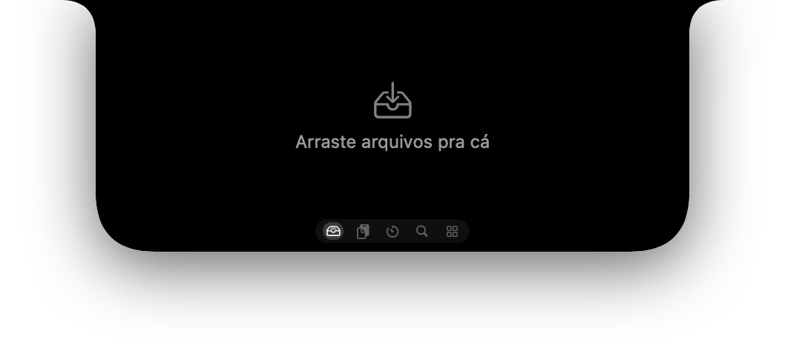
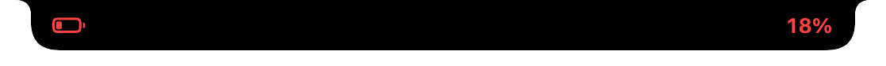
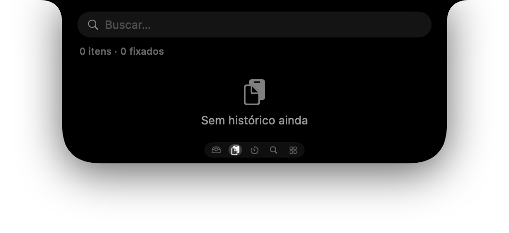
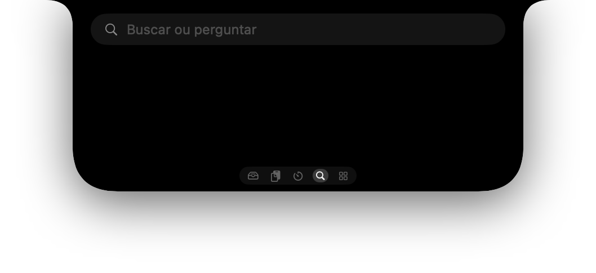

# Cove

**A Dynamic Island for the Mac notch — 100% Swift/SwiftUI, no Electron, no subscriptions.**

Cove turns the notch (or the top-center of any external display) into a live island: now-playing with real controls, system HUDs (volume, brightness, battery, Bluetooth, Focus, lock), a file shelf, clipboard history, timers, a search bar, and a set of "droplet" pages you can open from the island.

<p align="center">
  
</p>

<p align="center">
  <br>
  
</p>

<p align="center">
  
  
</p>

## Features

| Area | What you get |
|---|---|
| **Now playing** | Title / artist / artwork from any app (Music, Spotify, browsers…) via MediaRemote, play/pause/skip, shuffle/repeat/favorite through Apple Events, waveform animation, synced lyrics |
| **System HUDs** | Volume, brightness, keyboard backlight, battery / charger, Bluetooth device connect + battery, Focus mode, screen lock, VPN, network — drawn in the island, native HUD suppressed |
| **Shelf** | Drag files into the island, keep them there, drop them anywhere later; Quick Look; thumbnails |
| **Clipboard** | Searchable history with pin, rename, image entries, paste-at-cursor |
| **Droplets** | Apps launcher, Notes, Emoji picker, Converter (units/currency), Terminal (SwiftTerm), Stats (CPU/RAM/disk/network), Notifications mirror, Tools |
| **Search** | Spotlight-style search with actions (create reminder, open app, math…) |
| **Captures** | Screenshot / screen recording with annotation editor, OCR on captures |
| **Voice memos** | Record in the island, on-device transcription (Speech framework) |
| **Calendar** | Next event countdown, meeting links, calendar grid |
| **Timers** | Multiple named timers with ring progress |
| **Lock screen** | Island stays on the lock screen with tinted widgets (focus, weather, battery, media, event, timer) |
| **Multi-display** | One island per screen; real notch geometry on built-ins, simulated capsule on external displays |
| **Updates** | Sparkle 2 with EdDSA-signed appcast |

Everything is written in Swift 5.10 / SwiftUI with AppKit where needed. No web views.

## Requirements

- macOS **15.0** or newer (Apple Silicon or Intel)
- Xcode 16 command line tools (`xcode-select --install`) — Swift 5.10+

## Install

### Build from source

```bash
git clone https://github.com/spyko-app/cove.git
cd cove
./scripts/make-app.sh          # release build → build/Cove.app
open build/Cove.app
```

`make-app.sh` builds in release mode, compiles the MediaRemote adapter (`adapter/mradapter.m`), bundles Sparkle, generates the icon and ad-hoc signs the bundle. It is transactional: the `.app` only appears when the whole build succeeded.

Development loop:

```bash
swift build && .build/debug/Cove       # run directly (adapter loaded from ./adapter)
swift test                             # 400+ unit tests
```

### Permissions (asked on first use, all optional)

| Permission | Used for |
|---|---|
| Accessibility | Suppress the native volume/brightness HUD, media key tap, paste-at-cursor |
| Screen Recording | Captures droplet, notification mirror |
| Automation (Apple Events) | Shuffle / repeat / favorite in Music & Spotify, reply in Messages |
| Calendars / Reminders | Next-event widget, create reminders from search |
| Bluetooth | Device connect + battery HUD |
| Microphone / Speech | Voice memos + on-device transcription |
| Camera | Optional face enrolment on the lock screen |

Cove works without any of them — each feature simply stays off until you grant it. The onboarding window lists what is granted.

## How it works (the interesting bits)

- **MediaRemote on macOS 15.4+**: Apple blocks non-Apple binaries from `MediaRemote.framework`. Cove loads a tiny Objective-C dylib (`adapter/mradapter.m`) inside `/usr/bin/perl` (an Apple-signed host) through `DynaLoader`, and talks to it over stdin/stdout (JSON now-playing stream, `cmd <n>` for commands).
- **Native HUD suppression**: `OSDUIHelper` is kick-started and paused with `SIGSTOP`, watched by a 10 s watchdog, and resumed (`SIGCONT`) on quit or when you toggle the feature. Only the island draws.
- **Island geometry**: an `NSPanel` at status-bar level sized from `safeAreaInsets` / `auxiliaryTopLeftArea`, so it hugs the real notch; on displays without a notch it becomes a top-center capsule.
- **Lock screen**: the island is re-parented above `loginwindow` and tints itself from the wallpaper so it stays legible.

## Project layout

```
Sources/Cove/
  Core/        services (media, HUDs, clipboard, shelf, calendar, timers, capture, lyrics, lock screen…)
  UI/          NotchPanel / NotchView, HUDs, droplet pages, settings, onboarding
  Main.swift   app delegate, preview flags
Tests/CoveTests/     unit tests for the pure logic (layout, policies, stores, parsers)
adapter/             MediaRemote adapter (ObjC dylib + perl loader)
scripts/make-app.sh  bundle builder
```

### Preview flags (for screenshots and UI work)

```bash
COVE_PREVIEW_EXPANDED=1 COVE_PREVIEW_PAGE=1 .build/debug/Cove   # island open on a given droplet page
COVE_PREVIEW_HUD=volume .build/debug/Cove                       # volume|brightness|battery|device|focus|lock|event
COVE_PREVIEW_NOMEDIA=1                                          # skip the media adapter
```

## Roadmap

- English localization of the UI (strings are currently Portuguese)
- Developer ID signing + notarized releases
- Plugin API for third-party droplets

## Credits

Inspired by Alcove, Droppy and NotchNook. Techniques borrowed with thanks from the SlimHUD (HUD suppression) and mediaremote-adapter (perl host) projects. Built on [SwiftTerm](https://github.com/migueldeicaza/SwiftTerm) and [Sparkle](https://sparkle-project.org).

## License

[MIT](LICENSE)
